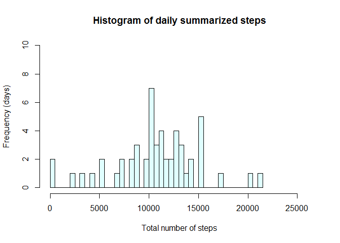

# Reproducible Research: Peer Assessment 1

<BR>

## Loading and preprocessing the data

Firstly, it is set as working directory the folder where the source file is. The archive with the project data file is extracted to a "data" folder in this directory, and a data frame **activity** is loaded with the original data set, that includes these variables:

* steps: Number of steps taking in a 5-minute interval (missing values are coded as NA)
* date: The date on which the measurement was taken in YYYY-MM-DD format
* interval: Identifier for the 5-minute interval in which measurement was taken


```r
# Loading the data

# Let's extract the archive with the data file
setwd("D:/Training/Data Science/JHU Specialization/Reproducible Research/Peer Assesments/Peer Assesment1/RepData_PeerAssessment1")
if (!file.exists("./data")) { dir.create("./data") }
unzip("activity.zip", exdir = "./data")

# Let's load the data
activity <- read.csv("./data/activity.csv")

# Let's see the structure and summary statistics
str(activity)
```

```
## 'data.frame':	17568 obs. of  3 variables:
##  $ steps   : int  NA NA NA NA NA NA NA NA NA NA ...
##  $ date    : Factor w/ 61 levels "2012-10-01","2012-10-02",..: 1 1 1 1 1 1 1 1 1 1 ...
##  $ interval: int  0 5 10 15 20 25 30 35 40 45 ...
```

```r
summary(activity)
```

```
##      steps                date          interval     
##  Min.   :  0.00   2012-10-01:  288   Min.   :   0.0  
##  1st Qu.:  0.00   2012-10-02:  288   1st Qu.: 588.8  
##  Median :  0.00   2012-10-03:  288   Median :1177.5  
##  Mean   : 37.38   2012-10-04:  288   Mean   :1177.5  
##  3rd Qu.: 12.00   2012-10-05:  288   3rd Qu.:1766.2  
##  Max.   :806.00   2012-10-06:  288   Max.   :2355.0  
##  NA's   :2304     (Other)   :15840
```

There are 2.304 not available values for steps. We cannot exclude them because they can be ignored only for the first part of the assigned, while they will need to be imputed later for another part.

I consider two trasformations appropriate to improve the data for the analysis: 

#### 1. Dates can be converted from factor to date. 

Dates values are represented as a factor. We can convert this variable type to date
in order to enhance its semantic and to be able to compute week days and week ends for the last part.

#### 2. Interval identifiers are not equally distant and a new variable can be added to beat this lack.  

Since there are 24 \* 60 = 1440 minutes in a day, the maximum value for **interval** is 2355, and the values begin with 0, 5, 10, 15, 20, 25. ... it is denoting hour and minute but not in a string format HHMM but with an integer computed as hour \* 100 + minute, so 5 =  0 hours 5 minutes, 2355 = 23 hours 55 minutes, and 200 denotes 2 hours 0 minutes.

This is a valid representation, an its order is compatible with the chronological order of the minutes through the day. Therefor they are not equally separated. For example, the distance between 4h 55min and 5h 00min is 500 - 455 = 45 is different from the distance between 5h 00min and 5h 05min is 505 - 500 = 5, while they are consecutive intervals and their duration in time is 5 minutes for both. It is better to transform this variable in another one without this inconvenient in order to distribute each 5 minutes uniformly in plots. For this purpose, I will add a new variable **startingminute** to the data frame computing the number of minutes from 00:00 to the starting minute of a given 5-minute interval. The starting minutes for two consecutive intervals will always differ in 5, so their values over an x-axis will be equally distant. 

We could consider joining date and interval/starting minute to compose a full date consisting of
year, month, day, hour and minute, but the questions can be adressed working with date and time separately, so it is not necessary. 


```r
# Processing/transforming the data into a format suitable for the analysis

# The date variable is converted from factor to date
activity$date <- as.Date(activity$date)

# Starting minute is a better identifier for the interval than the interval variable provided
# in the original data set, because it provides equally distant identifiers for the intervals. 
# In the following formula, %% indicates x mod y and %/% indicates integer division.
activity$startingminute <- ((activity$interval %/% 100) * 60) + activity$interval %% 100

# As expected, the starting minute for the intervals comprehend from 0 minutes to 1435 = 1440 - 5.
summary(activity$startingminute)
```

```
##    Min. 1st Qu.  Median    Mean 3rd Qu.    Max. 
##     0.0   358.8   717.5   717.5  1076.0  1435.0
```

<BR>

## What is mean total number of steps taken per day?

For this part of the assignment, we can ignore the missing values in the dataset.

### 1. Total number of steps taken per day, ignoring missing values


```r
if (!"dplyr" %in% installed.packages()[ , 1]) { install.packages("dplyr") }
library(dplyr)
```

```
## 
## Attaching package: 'dplyr'
## 
## The following object is masked from 'package:stats':
## 
##     filter
## 
## The following objects are masked from 'package:base':
## 
##     intersect, setdiff, setequal, union
```

```r
days <- group_by(activity[complete.cases(activity), ], date)
dailysteps <- summarize(days, steps = sum(steps))
dailysteps
```

```
## Source: local data frame [53 x 2]
## 
##          date steps
## 1  2012-10-02   126
## 2  2012-10-03 11352
## 3  2012-10-04 12116
## 4  2012-10-05 13294
## 5  2012-10-06 15420
## 6  2012-10-07 11015
## 7  2012-10-09 12811
## 8  2012-10-10  9900
## 9  2012-10-11 10304
## 10 2012-10-12 17382
## ..        ...   ...
```

### 2. Histogram of the total number of steps taken each day.


```r
hist(dailysteps$steps, col = "lightcyan", breaks = 50, 
     main = "Histogram of daily summarized steps", 
     xlim = c(0, max(dailysteps$steps) + 5000), ylim = c(0, 10),
     xlab = "Total number of steps", ylab = "Frequency (days)")
```

 


### 3. Mean and median of the total number of steps taken per day, ignoring missing values.


```r
dailymean <- mean(dailysteps$steps)
dailymean
```

```
## [1] 10766.19
```

```r
dailymedian <- median(dailysteps$steps)
dailymedian
```

```
## [1] 10765
```


Measure      | Value
------------ | -------------------------------
Daily Mean   | 10766.1886792453
Daily Median | 10765


<BR>


## What is the average daily activity pattern?

At this point we are still considering to ignore the missing values. 

### 1. Time series plot the 5-minute interval (x-axis) and the average number of steps taken, averaged across all days (y-axis).

Making use the starting minute of intervals instead of the original interval variable make the interval points to be distributed uniformly, such that each 5-minute interval has the same width. 


```r
intervalstart <- group_by(activity[complete.cases(activity), ], startingminute)
intervalmeans <- summarize(intervalstart, meansteps = mean(steps))
with (intervalmeans, plot(meansteps ~ startingminute, type = "l",
                 main = "Daily activity pattern", col = "#5AA2FF",
                 xlab = "5-minute interval starting minute", 
                 ylab = "Average number of steps", 
                 cex.lab = 1, cex.axis = 1, lwd = 2))
```

 

The same plot attending to the starting hour has the same shape but enhances the readability of x-axis:


```r
intervalmeans$startinghour <- intervalmeans$startingminute / 60
with (intervalmeans, plot(meansteps ~ startinghour, type = "l",
                          main = "Daily activity pattern", col = "#92DF4A",
                          xlab = "5-minute interval starting hour", 
                          ylab = "Average number of steps",  
                          xaxt = "n", lwd = 2,
                          cex.lab = 1, cex.axis = 1))
axis(1, at = 0:24)
```

 


### 2. Which 5-minute interval, on average across all the days in the dataset, contains the maximum number of steps?

Let's see the maximum average number of steps and find the corresponding interval (starting date).


```r
maxmeansteps <- max( intervalmeans$meansteps )
maxmeansteps
```

```
## [1] 206.1698
```

```r
# This is the interval starting minute for the maximum number of steps
intervalmax <- intervalmeans[ which.max( intervalmeans$meansteps ), ]$startingminute
intervalmax
```

```
## [1] 515
```

It's the 5-minute interval starting on the minute 515, so (515, 520). Translated to hours and minutes, it's 8 hours 
and 35 minutes.

Just to check this is correct, let's see that the corresponding interval value
in the aggregated complete cases is 835 as expected.


```r
# This is the interval identifier variable for the maximum number of steps
intervalmaxid <- activity[complete.cases(activity), ][ which.max( intervalmeans$meansteps ), ]$interval
intervalmaxid
```

```
## [1] 835
```


**Conclusion:**<BR>
The 5-minute interval, on average across all the days in the dataset, containing 
the maximum number of steps is the interval **835**, with starting minute **515**, corresponding with an average of **206.1698113** steps.


<BR>

## Imputing missing values


### 1. Total number of missing values in the dataset 

Let's see how many missing values are and how they are distributed by querying the summary statistics.


```r
summary(activity)
```

```
##      steps             date               interval      startingminute  
##  Min.   :  0.00   Min.   :2012-10-01   Min.   :   0.0   Min.   :   0.0  
##  1st Qu.:  0.00   1st Qu.:2012-10-16   1st Qu.: 588.8   1st Qu.: 358.8  
##  Median :  0.00   Median :2012-10-31   Median :1177.5   Median : 717.5  
##  Mean   : 37.38   Mean   :2012-10-31   Mean   :1177.5   Mean   : 717.5  
##  3rd Qu.: 12.00   3rd Qu.:2012-11-15   3rd Qu.:1766.2   3rd Qu.:1076.2  
##  Max.   :806.00   Max.   :2012-11-30   Max.   :2355.0   Max.   :1435.0  
##  NA's   :2304
```

Since there are only NA's in the variable **steps**, we can compute the number of missing values as the number of rows having NA in this variable: 


```r
totalNAs <- nrow(activity[is.na(activity$steps), ])
totalNAs
```

```
## [1] 2304
```
Further than to get a number of missing values, let's see which days are the dates corresponding to that missing values and how they are given.


```r
activityNA <- activity[is.na(activity$steps), ]
unique(activityNA$date)
```

```
## [1] "2012-10-01" "2012-10-08" "2012-11-01" "2012-11-04" "2012-11-09"
## [6] "2012-11-10" "2012-11-14" "2012-11-30"
```

```r
table(activityNA$date)
```

```
## 
## 2012-10-01 2012-10-08 2012-11-01 2012-11-04 2012-11-09 2012-11-10 
##        288        288        288        288        288        288 
## 2012-11-14 2012-11-30 
##        288        288
```

The previous table shows that all those 8 days have no data for 288 5-minutes intervals, so in other words, no data during 5 * 288 = 1440 minutes, that is no data during the whole day. 

<table border=1 cellpadding=3 cellspacing=3 > 
        <tr>
            <td align=center>&nbsp; **Total missing values** &nbsp;</td>
        </tr>
        <tr>
            <td align=center>**2304**</td>
        </tr>
</table>

### 2. Devise a strategy for filling in all of the missing values in the dataset. 


I prefer to consider median instead of mean because the median is a robust measure of center not impacted by skewness or extreme values. 

On the other side, since all the number of steps are N/A for every 5-minute interval in the 8 dates with missing values, my approach will be to fill the missing values by computing the **median number of steps in its corresponding 5-minute interval**.


### 3. Create a new dataset equal to the original but with the missing data filled in.

Firstly, we need to compute the median number of steps for every interval. We can make use of the previous aggrupation by interval starting minute. 

The imputation will be performed in a data frame **activitycompleted** coming from joining the data frame **activity** with the summarized medians for each interval.


```r
intervalmedians <- summarize(intervalstart, mediansteps = median(steps))

# Imputation
activitycompleted <- merge(activity, intervalmedians, by.x = "startingminute", 
                     by.y = "startingminute", all = FALSE)
activitycompleted <- mutate(activitycompleted, 
                            steps = ifelse (is.na(steps), mediansteps, steps))
# Deletion of the auxiliar variable mediansteps for filling the missing values
activitycompleted <- activitycompleted[ , !(names(activitycompleted) %in% "mediansteps")]

# Let's check there are no missing values in the resulting dataset
summary(activitycompleted)
```

```
##  startingminute       steps          date               interval     
##  Min.   :   0.0   Min.   :  0   Min.   :2012-10-01   Min.   :   0.0  
##  1st Qu.: 358.8   1st Qu.:  0   1st Qu.:2012-10-16   1st Qu.: 588.8  
##  Median : 717.5   Median :  0   Median :2012-10-31   Median :1177.5  
##  Mean   : 717.5   Mean   : 33   Mean   :2012-10-31   Mean   :1177.5  
##  3rd Qu.:1076.2   3rd Qu.:  8   3rd Qu.:2012-11-15   3rd Qu.:1766.2  
##  Max.   :1435.0   Max.   :806   Max.   :2012-11-30   Max.   :2355.0
```


### 4.1. Histogram of the total number of steps taken each day.


```r
dayscompleted <- group_by(activitycompleted, date)
dailystepscompleted <- summarize(dayscompleted, steps = sum(steps))

hist(dailystepscompleted$steps, col = "lightcyan", breaks = 50, 
     main = "Histogram of daily summarized steps", 
     xlim = c(0, max(dailystepscompleted$steps) + 5000), ylim = c(0, 10),
     xlab = "Total number of steps", ylab = "Frequency (days)")
```

 

### 4.2. Mean and median of the total number of steps taken per day.


```r
dailymeancompleted <- mean(dailystepscompleted$steps)
dailymeancompleted
```

```
## [1] 9503.869
```

```r
dailymediancompleted <- median(dailystepscompleted$steps)
dailymediancompleted
```

```
## [1] 10395
```

Measure      | Value
------------ | -------------------------------
Daily Mean (ignoring missing values)  | 10766.1886792453
Daily Median (ignoring missing values) | 10765
Daily Mean (imputing missing values)  | 9503.86885245902
Daily Median (imputing missing values) | 10395

### 4.3. Do these values differ from the estimates from the first part of the assignment?

Both values differ from the estimates from the first part of the assignment, by decreasing their values from the earlier estimations without imputed values.

### 4.4. What is the impact of imputing missing data on the estimates of the total daily number of steps?

The impact of imputing missing data is that the 8 days with missing data draw a new bar in the histogram with height of 8 comprehending all of them. This bar appears on the left, between 0 and 5000, near from 1000, and we can figure out the accurate x-value of this new bar by getting the summarized number of steps for any of this 8 day with NA's. Let's see for the first date with missing values, which is the date "2012-10-01".


```r
dailystepscompleted[as.character(dailystepscompleted$date) == "2012-10-01", ]$steps
```

```
## [1] 1141
```

Then the position of the additional bar is 1141 (number of steps) in the X axis. This 1141 comes from adding the median steps for each interval, which are the estimates for these days. 

<BR>


## Are there differences in activity patterns between weekdays and weekends?


### 1. Create a new factor variable in the dataset with two levels - "weekday" and "weekend".

This new variable **daytype** will be calculated conditionally depending on the day of the week for the date.


```r
# Since the locale in my system is not English, I need to set it to work with week days in English
Sys.setlocale("LC_TIME", "English")
```

```
## [1] "English_United States.1252"
```

```r
activitycompleted$daytype <- as.factor(ifelse (weekdays(activitycompleted$date)
                                 %in% c("Saturday", "Sunday"), "weekend", "weekday"))
```

### 2. Make a panel plot containing a time series plot of the 5-minute interval (x-axis) and the average number of steps taken, averaged across all weekday days or weekend days (y-axis). 

In the sample plot that was provided in the repository, the **interval** variable was used in the x-axis without being transformed to provide equally distant interval identifiers. Being aware that the provided interval identifiers are not uniformly distant across the x axis, I make use of the variable **startingminute** that I added to fix this problem. 


```r
intervalstartcompleted <- group_by(activitycompleted, startingminute, daytype)
intervalmeanscompleted <- summarize(intervalstartcompleted, meansteps = mean(steps))

if (!"ggplot2" %in% installed.packages()[ , 1]) { install.packages("ggplot2") }
library(ggplot2)
g <- ggplot(intervalmeanscompleted, aes(x = startingminute, meansteps))
g + geom_line( col = "#5AA2FF" ) + facet_wrap ( ~ daytype) +
    theme_bw() + xlab("Interval starting minute") + ylab("Average number of steps") +
    ggtitle("Comparative analysis of activity pattern on day type")   
```

 

 
 


